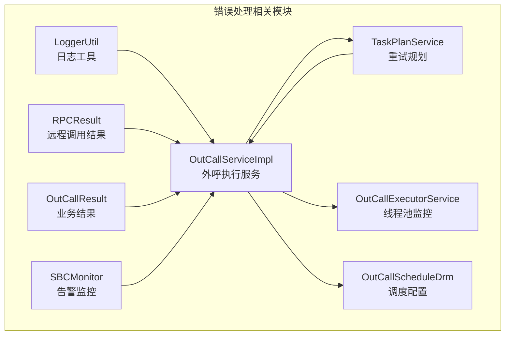
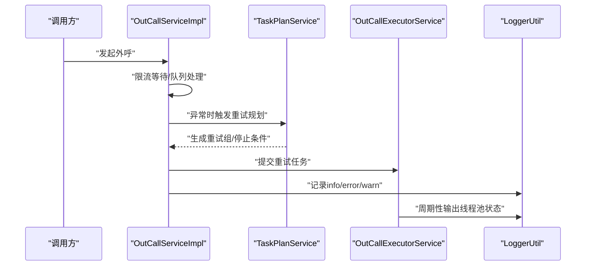
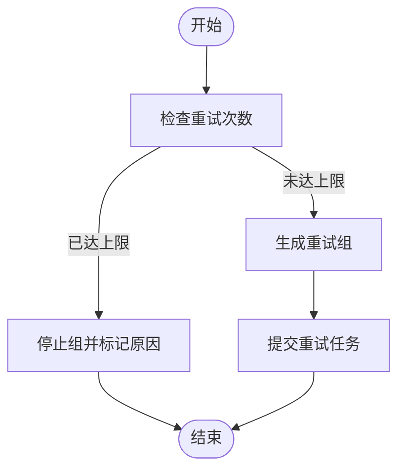
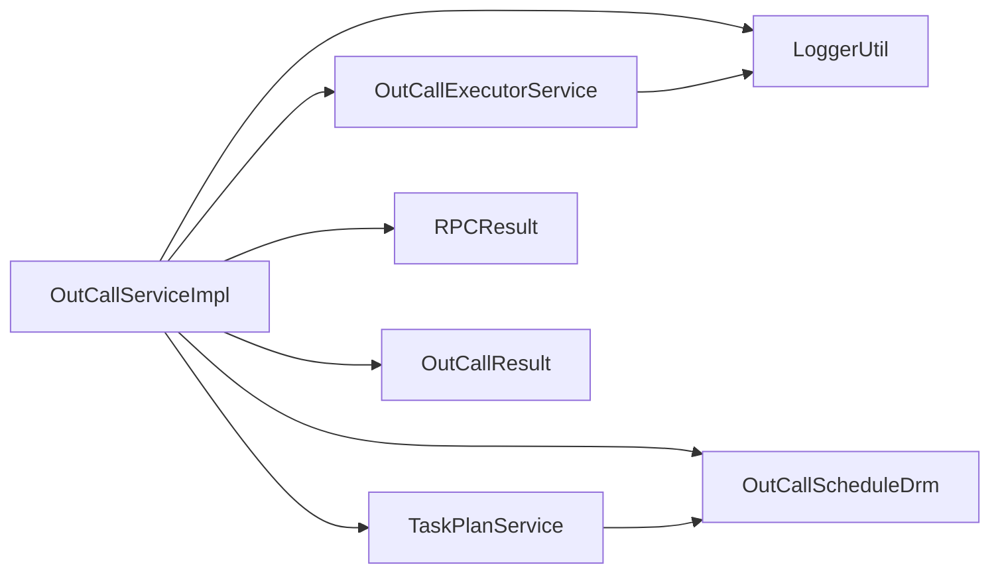

# 错误处理机制

<cite>
**本文引用的文件**
- [LoggerUtil.java](file://src/main/java/org/qianye/LoggerUtil.java)
- [RPCResult.java](file://src/main/java/org/qianye/RPCResult.java)
- [OutCallResult.java](file://src/main/java/org/qianye/OutCallResult.java)
- [OutCallServiceImpl.java](file://src/main/java/org/qianye/OutCallServiceImpl.java)
- [OutCallExecutorService.java](file://src/main/java/org/qianye/OutCallExecutorService.java)
- [OutCallScheduleDrm.java](file://src/main/java/org/qianye/OutCallScheduleDrm.java)
- [TaskPlanService.java](file://src/main/java/org/qianye/TaskPlanService.java)
- [SBCMonitor.java](file://src/main/java/org/qianye/SBCMonitor.java)
</cite>

## 目录
1. [简介](#简介)
2. [项目结构](#项目结构)
3. [核心组件](#核心组件)
4. [架构总览](#架构总览)
5. [详细组件分析](#详细组件分析)
6. [依赖分析](#依赖分析)
7. [性能考量](#性能考量)
8. [故障排查指南](#故障排查指南)
9. [结论](#结论)

## 简介
本文件面向 Outcall 系统的错误处理机制，系统性阐述异常分类与处理策略、重试与降级设计、告警触发与级别、日志工具使用规范，以及 RPCResult 与 OutCallResult 的错误码与错误信息封装方式。文档同时提供常见异常场景的处理示例与恢复建议，帮助开发者快速定位问题并实施修复。

## 项目结构
围绕错误处理的关键模块如下：
- 日志工具：统一日志封装，支持占位符格式化与异常堆栈输出
- 结果模型：RPCResult 与 OutCallResult，分别承载远程调用与业务结果的错误码与消息
- 执行服务：OutCallServiceImpl 贯穿外呼全流程，包含限流等待、队列处理、异常捕获与重试规划
- 线程池监控：OutCallExecutorService 提供线程池状态监控与优雅关闭
- 调度配置：OutCallScheduleDrm 提供重试次数、限流等待、队列长度等阈值
- 重试规划：TaskPlanService 负责异常后生成重试组与停止条件判断
- 告警监控：SBCMonitor 提供定时事件上报与离线检测

图表来源
- [LoggerUtil.java](file://src/main/java/org/qianye/LoggerUtil.java#L1-L56)
- [RPCResult.java](file://src/main/java/org/qianye/RPCResult.java#L1-L11)
- [OutCallResult.java](file://src/main/java/org/qianye/OutCallResult.java#L1-L50)
- [OutCallServiceImpl.java](file://src/main/java/org/qianye/OutCallServiceImpl.java#L1-L1191)
- [OutCallExecutorService.java](file://src/main/java/org/qianye/OutCallExecutorService.java#L1-L211)
- [OutCallScheduleDrm.java](file://src/main/java/org/qianye/OutCallScheduleDrm.java#L1-L113)
- [TaskPlanService.java](file://src/main/java/org/qianye/TaskPlanService.java#L1-L1112)
- [SBCMonitor.java](file://src/main/java/org/qianye/SBCMonitor.java#L1-L22)

章节来源
- [LoggerUtil.java](file://src/main/java/org/qianye/LoggerUtil.java#L1-L56)
- [RPCResult.java](file://src/main/java/org/qianye/RPCResult.java#L1-L11)
- [OutCallResult.java](file://src/main/java/org/qianye/OutCallResult.java#L1-L50)
- [OutCallServiceImpl.java](file://src/main/java/org/qianye/OutCallServiceImpl.java#L1-L1191)
- [OutCallExecutorService.java](file://src/main/java/org/qianye/OutCallExecutorService.java#L1-L211)
- [OutCallScheduleDrm.java](file://src/main/java/org/qianye/OutCallScheduleDrm.java#L1-L113)
- [TaskPlanService.java](file://src/main/java/org/qianye/TaskPlanService.java#L1-L1112)
- [SBCMonitor.java](file://src/main/java/org/qianye/SBCMonitor.java#L1-L22)

## 核心组件
- 日志工具 LoggerUtil：提供 info/error/warn 等静态方法，支持占位符格式化与异常堆栈自动附加输出，避免不必要的字符串拼接与性能损耗
- RPCResult：远程调用结果载体，包含 code/data/message 字段，用于封装远端接口返回
- OutCallResult：业务结果载体，包含 success/errorCode/errorMsg/acid，提供成功/失败构造方法与流量限制专用失败方法
- OutCallServiceImpl：外呼执行主流程，负责限流等待、队列异步处理、异常捕获、状态更新与重试规划
- OutCallExecutorService：线程池监控与优雅关闭，周期性输出各线程池状态，便于观察与告警
- OutCallScheduleDrm：调度配置中心，定义最大重试次数、限流等待时间、队列长度阈值、线程池规模等
- TaskPlanService：异常后生成重试组，判断是否达到最大重试或超出任务时间范围而停止
- SBCMonitor：定时事件上报与离线检测，用于外部监控系统对接

章节来源
- [LoggerUtil.java](file://src/main/java/org/qianye/LoggerUtil.java#L1-L56)
- [RPCResult.java](file://src/main/java/org/qianye/RPCResult.java#L1-L11)
- [OutCallResult.java](file://src/main/java/org/qianye/OutCallResult.java#L1-L50)
- [OutCallServiceImpl.java](file://src/main/java/org/qianye/OutCallServiceImpl.java#L1-L1191)
- [OutCallExecutorService.java](file://src/main/java/org/qianye/OutCallExecutorService.java#L1-L211)
- [OutCallScheduleDrm.java](file://src/main/java/org/qianye/OutCallScheduleDrm.java#L1-L113)
- [TaskPlanService.java](file://src/main/java/org/qianye/TaskPlanService.java#L1-L1112)
- [SBCMonitor.java](file://src/main/java/org/qianye/SBCMonitor.java#L1-L22)

## 架构总览
下图展示错误处理在系统中的交互路径：外呼执行服务在关键节点捕获异常，封装业务结果，决定是否进入重试规划；线程池监控定期输出状态；调度配置影响重试与限流行为；日志工具贯穿所有环节。

图表来源
- [OutCallServiceImpl.java](file://src/main/java/org/qianye/OutCallServiceImpl.java#L1-L1191)
- [TaskPlanService.java](file://src/main/java/org/qianye/TaskPlanService.java#L1-L1112)
- [OutCallExecutorService.java](file://src/main/java/org/qianye/OutCallExecutorService.java#L1-L211)
- [LoggerUtil.java](file://src/main/java/org/qianye/LoggerUtil.java#L1-L56)

## 详细组件分析

### 异常分类与处理策略
- 业务异常
  - 场景：任务状态非法、不在当前呼叫时间窗口、主叫不存在、今日重呼拦截、限流触发
  - 处理：封装 OutCallResult.fail(...) 或 failForFlowLimit()，设置 errorCode/errorMsg，必要时更新队列/组状态为 WAITING/STOP
  - 示例参考
    - [任务状态非法与不在当前时间窗口](file://src/main/java/org/qianye/OutCallServiceImpl.java#L296-L324)
    - [主叫不存在](file://src/main/java/org/qianye/OutCallServiceImpl.java#L1030-L1034)
    - [今日重呼拦截](file://src/main/java/org/qianye/OutCallServiceImpl.java#L1070-L1074)
    - [限流触发](file://src/main/java/org/qianye/OutCallServiceImpl.java#L1103-L1107)
- 系统异常
  - 场景：线程池满、队列积压过大、Redis 锁冲突、RPC 调用失败
  - 处理：记录 error 日志，按需更新状态为 WAITING/STOP，提交重试任务至 retryThreadPool
  - 示例参考
    - [线程池满/队列积压](file://src/main/java/org/qianye/OutCallServiceImpl.java#L700-L775)
    - [RPC 调用失败](file://src/main/java/org/qianye/OutCallServiceImpl.java#L1108-L1112)
    - [线程池监控与异常](file://src/main/java/org/qianye/OutCallExecutorService.java#L131-L135)
- 网络异常
  - 场景：远端接口不可用、超时、返回非 200
  - 处理：记录 error 日志，返回 UNKNOWN_ERROR，必要时触发重试
  - 示例参考
    - [RPCResult 非 200 或空数据](file://src/main/java/org/qianye/OutCallServiceImpl.java#L1108-L1112)

章节来源
- [OutCallServiceImpl.java](file://src/main/java/org/qianye/OutCallServiceImpl.java#L1007-L1132)
- [OutCallExecutorService.java](file://src/main/java/org/qianye/OutCallExecutorService.java#L131-L135)

### 重试策略设计
- 最大重试次数
  - 通过 OutCallScheduleDrm.getMaxCallFlowRetries() 获取，超过则标记 STOP 并写入 STOP_REASON=MAX_RETRIES
  - 参考：[重试次数判断与停止条件](file://src/main/java/org/qianye/TaskPlanService.java#L335-L364)
- 重试触发时机
  - 异常发生时，调用 replanExceptionTask(queueGroupDTO, queueCodes)，生成重试组
  - 参考：[异常重试规划入口](file://src/main/java/org/qianye/OutCallServiceImpl.java#L409-L411)
- 重试组生成
  - 依据失败队列构建新的重试组，状态置为 WAITING，等待后续调度
  - 参考：[生成重试组](file://src/main/java/org/qianye/TaskPlanService.java#L294-L312)
- 限流等待与超时
  - waitForRateLimitRelease 支持带超时的限流等待，超时返回 false，触发 WAITING/STOP 等处理
  - 参考：[限流等待与超时](file://src/main/java/org/qianye/OutCallServiceImpl.java#L602-L679)

图表来源
- [TaskPlanService.java](file://src/main/java/org/qianye/TaskPlanService.java#L335-L364)
- [TaskPlanService.java](file://src/main/java/org/qianye/TaskPlanService.java#L294-L312)
- [OutCallServiceImpl.java](file://src/main/java/org/qianye/OutCallServiceImpl.java#L409-L411)

章节来源
- [TaskPlanService.java](file://src/main/java/org/qianye/TaskPlanService.java#L142-L312)
- [OutCallServiceImpl.java](file://src/main/java/org/qianye/OutCallServiceImpl.java#L602-L679)

### 告警机制与级别
- 告警触发条件
  - 线程池队列积压过大：在队列处理阶段检测 makeCallThreadPool.getQueue().size() 与阈值比较，超过则记录 info 并可能触发 WAITING/STOP
  - 限流超时：waitForRateLimitRelease 超时返回 false，记录 RateLimitTimeout
  - 状态异常：预处理阶段发现非 PLANNING 状态的组/队列，记录 groupStatusError
  - 线程池监控：周期性输出线程池状态，便于外部监控系统采集
- 告警级别
  - INFO：常规状态变更与提示（如队列积压、等待下一轮）
  - WARN：潜在风险或异常（如状态异常、停止组）
  - ERROR：严重异常（如线程池监控异常、RPC 调用异常）
- 参考
  - [队列积压与状态更新](file://src/main/java/org/qianye/OutCallServiceImpl.java#L144-L149)
  - [限流超时](file://src/main/java/org/qianye/OutCallServiceImpl.java#L667-L671)
  - [状态异常告警](file://src/main/java/org/qianye/OutCallServiceImpl.java#L198-L201)
  - [线程池监控输出](file://src/main/java/org/qianye/OutCallExecutorService.java#L66-L130)

章节来源
- [OutCallServiceImpl.java](file://src/main/java/org/qianye/OutCallServiceImpl.java#L144-L149)
- [OutCallServiceImpl.java](file://src/main/java/org/qianye/OutCallServiceImpl.java#L667-L671)
- [OutCallServiceImpl.java](file://src/main/java/org/qianye/OutCallServiceImpl.java#L198-L201)
- [OutCallExecutorService.java](file://src/main/java/org/qianye/OutCallExecutorService.java#L66-L130)

### LoggerUtil 工具类使用与最佳实践
- 使用方法
  - info/log.warn/log.error：统一占位符格式化输出，避免手动字符串拼接
  - error(Logger, Exception, String format, Object... params)：自动将异常附加到末尾，由 SLF4J 识别 Throwable 参数输出堆栈
- 最佳实践
  - 仅在日志级别允许时才进行格式化，减少不必要的开销
  - 对关键异常路径使用 error 并附带异常对象，便于定位
  - 对可预期的业务异常使用 info/warn，区分不同严重程度
- 参考
  - [LoggerUtil 方法定义](file://src/main/java/org/qianye/LoggerUtil.java#L10-L54)

章节来源
- [LoggerUtil.java](file://src/main/java/org/qianye/LoggerUtil.java#L10-L54)

### RPCResult 与 OutCallResult 的错误码与封装
- RPCResult
  - 字段：code/data/message，用于承载远端接口返回
  - 参考：[RPCResult 定义](file://src/main/java/org/qianye/RPCResult.java#L6-L10)
- OutCallResult
  - 字段：success/errorCode/errorMsg/acid
  - 常用错误码常量：FAIL_REASON、STOP_REASON、FLOW_LIMIT、MAX_RETRIES、NOT_MATCH_TIME、QUEUE_LIMIT、POOL_FULL、UNKNOWN_ERROR、CALLER_NOT_EXIST、RECALL_REASON 等
  - 构造方法：success(...)、fail(...)、failForFlowLimit()
  - 参考：[OutCallResult 定义与构造](file://src/main/java/org/qianye/OutCallResult.java#L6-L49)
- 结果填充与状态更新
  - populateCallResult 根据 OutCallResult 的 errorCode 设置队列状态与扩展信息
  - 参考：[结果填充与状态更新](file://src/main/java/org/qianye/OutCallServiceImpl.java#L934-L972)

章节来源
- [RPCResult.java](file://src/main/java/org/qianye/RPCResult.java#L6-L10)
- [OutCallResult.java](file://src/main/java/org/qianye/OutCallResult.java#L6-L49)
- [OutCallServiceImpl.java](file://src/main/java/org/qianye/OutCallServiceImpl.java#L934-L972)

### 常见异常场景与处理示例
- 主叫不存在
  - 行为：返回 CALLER_NOT_EXIST，队列状态置为 STOP
  - 参考：[主叫不存在处理](file://src/main/java/org/qianye/OutCallServiceImpl.java#L1030-L1034)
- 今日重呼拦截
  - 行为：返回 RECALL_REASON，队列状态置为 STOP
  - 参考：[今日重呼拦截](file://src/main/java/org/qianye/OutCallServiceImpl.java#L1070-L1074)
- 限流触发
  - 行为：返回 FLOW_LIMIT，队列状态置为 WAITING
  - 参考：[限流触发](file://src/main/java/org/qianye/OutCallServiceImpl.java#L1103-L1107)
- 线程池满/队列积压
  - 行为：返回 POOL_FULL/QUEUE_LIMIT，队列状态置为 WAITING，完成后解锁
  - 参考：[线程池满/队列积压处理](file://src/main/java/org/qianye/OutCallServiceImpl.java#L700-L775)
- RPC 调用失败
  - 行为：返回 UNKNOWN_ERROR，触发重试规划
  - 参考：[RPC 调用失败](file://src/main/java/org/qianye/OutCallServiceImpl.java#L1108-L1112)

章节来源
- [OutCallServiceImpl.java](file://src/main/java/org/qianye/OutCallServiceImpl.java#L1030-L1034)
- [OutCallServiceImpl.java](file://src/main/java/org/qianye/OutCallServiceImpl.java#L1070-L1074)
- [OutCallServiceImpl.java](file://src/main/java/org/qianye/OutCallServiceImpl.java#L1103-L1107)
- [OutCallServiceImpl.java](file://src/main/java/org/qianye/OutCallServiceImpl.java#L700-L775)
- [OutCallServiceImpl.java](file://src/main/java/org/qianye/OutCallServiceImpl.java#L1108-L1112)

### 错误恢复策略与降级机制
- 降级策略
  - 队列积压/线程池满：将队列状态置为 WAITING，稍后重试
  - 限流超时：等待下一轮再尝试，避免雪崩
  - 任务/组状态异常：更新为 WAITING/STOP，记录扩展信息
- 恢复策略
  - 重试组：基于失败队列生成新的重试组，等待后续调度
  - 停止条件：达到最大重试次数或超出任务时间范围时停止
- 参考
  - [生成重试组与停止条件](file://src/main/java/org/qianye/TaskPlanService.java#L294-L364)
  - [最大重试次数与停止](file://src/main/java/org/qianye/TaskPlanService.java#L335-L364)

章节来源
- [TaskPlanService.java](file://src/main/java/org/qianye/TaskPlanService.java#L294-L364)

## 依赖分析
- 组件耦合
  - OutCallServiceImpl 依赖 LoggerUtil、OutCallExecutorService、OutCallScheduleDrm、TaskPlanService、RPCResult/OutCallResult
  - TaskPlanService 依赖 OutCallScheduleDrm、队列服务、Redis 锁
  - OutCallExecutorService 依赖 LoggerUtil 输出线程池状态
- 外部依赖
  - 远端接口调用通过 RPCResult 承载返回
  - Redis 用于锁与缓存，影响重试与去重
- 循环依赖
  - 未发现直接循环依赖，模块职责清晰

图表来源
- [OutCallServiceImpl.java](file://src/main/java/org/qianye/OutCallServiceImpl.java#L1-L1191)
- [OutCallExecutorService.java](file://src/main/java/org/qianye/OutCallExecutorService.java#L1-L211)
- [OutCallScheduleDrm.java](file://src/main/java/org/qianye/OutCallScheduleDrm.java#L1-L113)
- [TaskPlanService.java](file://src/main/java/org/qianye/TaskPlanService.java#L1-L1112)
- [LoggerUtil.java](file://src/main/java/org/qianye/LoggerUtil.java#L1-L56)
- [RPCResult.java](file://src/main/java/org/qianye/RPCResult.java#L1-L11)
- [OutCallResult.java](file://src/main/java/org/qianye/OutCallResult.java#L1-L50)

章节来源
- [OutCallServiceImpl.java](file://src/main/java/org/qianye/OutCallServiceImpl.java#L1-L1191)
- [OutCallExecutorService.java](file://src/main/java/org/qianye/OutCallExecutorService.java#L1-L211)
- [OutCallScheduleDrm.java](file://src/main/java/org/qianye/OutCallScheduleDrm.java#L1-L113)
- [TaskPlanService.java](file://src/main/java/org/qianye/TaskPlanService.java#L1-L1112)
- [LoggerUtil.java](file://src/main/java/org/qianye/LoggerUtil.java#L1-L56)
- [RPCResult.java](file://src/main/java/org/qianye/RPCResult.java#L1-L11)
- [OutCallResult.java](file://src/main/java/org/qianye/OutCallResult.java#L1-L50)

## 性能考量
- 日志格式化
  - 使用 LoggerUtil 的占位符方法，避免在日志级别关闭时仍进行字符串拼接
- 线程池配置
  - OutCallExecutorService 提供多套线程池，结合 OutCallScheduleDrm 动态调整核心/最大线程数与队列长度阈值
- 限流与节流
  - waitForRateLimitRelease 带超时等待，避免长时间阻塞；requestRateControl 可平滑请求节奏
- 资源释放
  - 任务完成后及时解锁 Redis 锁，避免死锁与资源泄漏

[本节为通用指导，无需列出具体文件来源]

## 故障排查指南
- 快速定位
  - 查看线程池监控日志，确认队列长度与活跃线程数是否异常
  - 搜索关键字：RateLimitTimeout、groupStatusError、tryLock fail、submit task error
- 常见问题
  - 队列积压：检查 makeCallThreadPool 队列长度与 OutCallScheduleDrm.getMakeCallMaxQueueSize()
  - 限流超时：检查 waitForRateLimitRelease 的超时时间与 sleep 间隔
  - 线程池满：检查线程池核心/最大线程数与拒绝策略
- 处理步骤
  - 将队列状态置为 WAITING，稍后重试
  - 达到最大重试次数后停止组并记录原因
  - 对于远端调用失败，记录 UNKNOWN_ERROR 并触发重试规划

章节来源
- [OutCallExecutorService.java](file://src/main/java/org/qianye/OutCallExecutorService.java#L66-L130)
- [OutCallServiceImpl.java](file://src/main/java/org/qianye/OutCallServiceImpl.java#L144-L149)
- [OutCallServiceImpl.java](file://src/main/java/org/qianye/OutCallServiceImpl.java#L667-L671)
- [OutCallServiceImpl.java](file://src/main/java/org/qianye/OutCallServiceImpl.java#L700-L775)
- [TaskPlanService.java](file://src/main/java/org/qianye/TaskPlanService.java#L335-L364)

## 结论
Outcall 系统的错误处理机制以“明确分类、可控重试、可观测告警”为核心设计原则。通过 LoggerUtil 统一日志、OutCallResult/RPCResult 明确错误语义、OutCallServiceImpl 全链路捕获与恢复、TaskPlanService 的重试规划与停止条件、OutCallExecutorService 的线程池监控与优雅关闭，以及 OutCallScheduleDrm 的阈值配置，实现了高可用与可维护的外呼系统。建议在生产环境中结合监控系统对线程池状态与关键异常进行持续观测，并根据业务负载动态调整阈值与线程池参数。