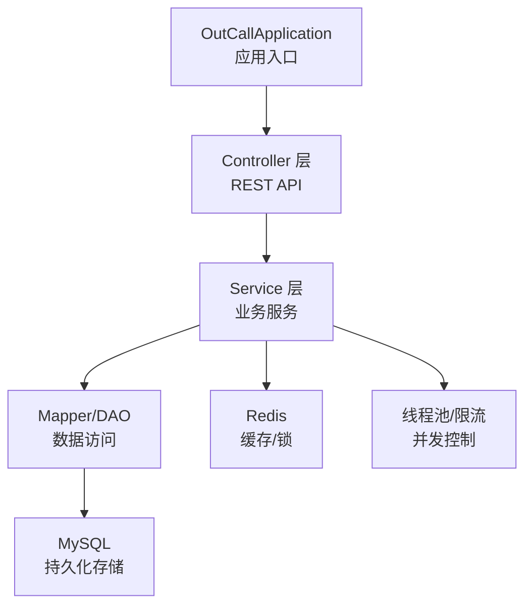
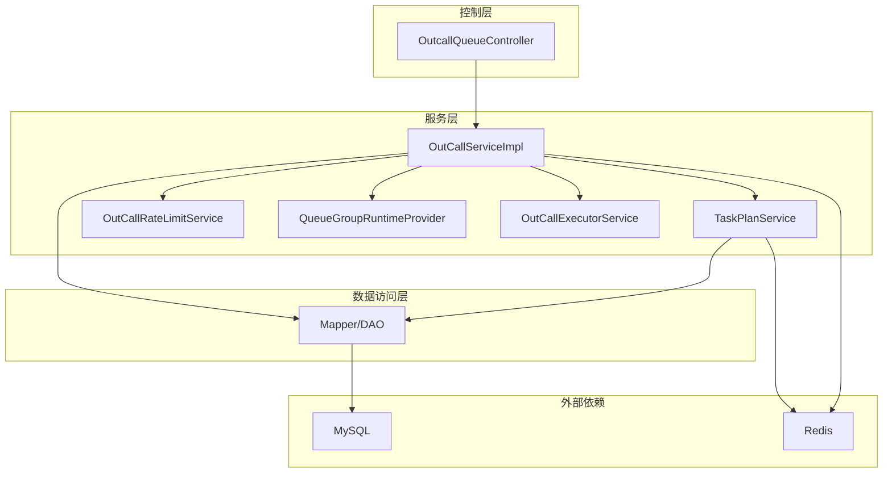
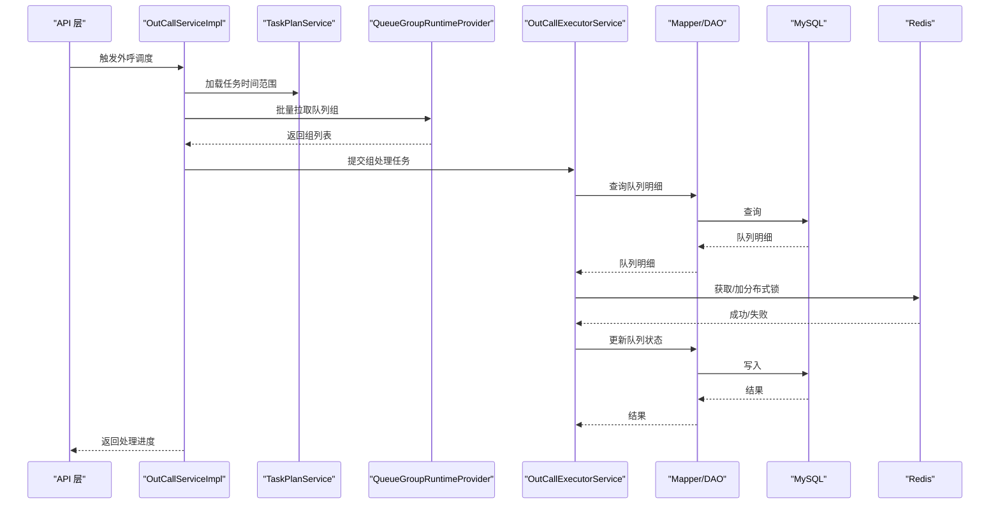
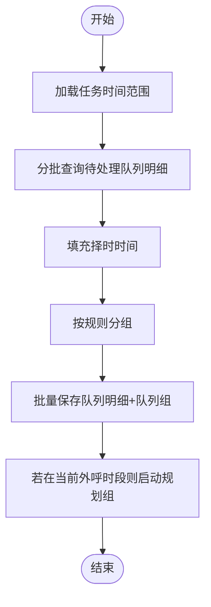
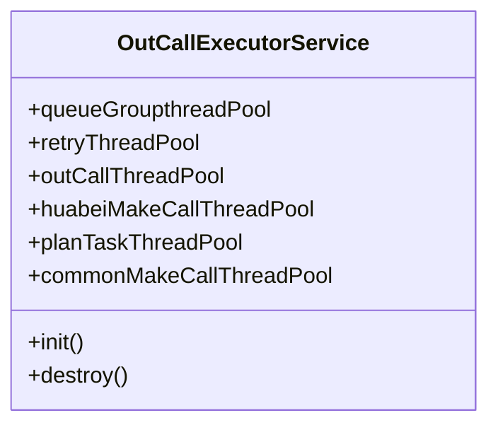
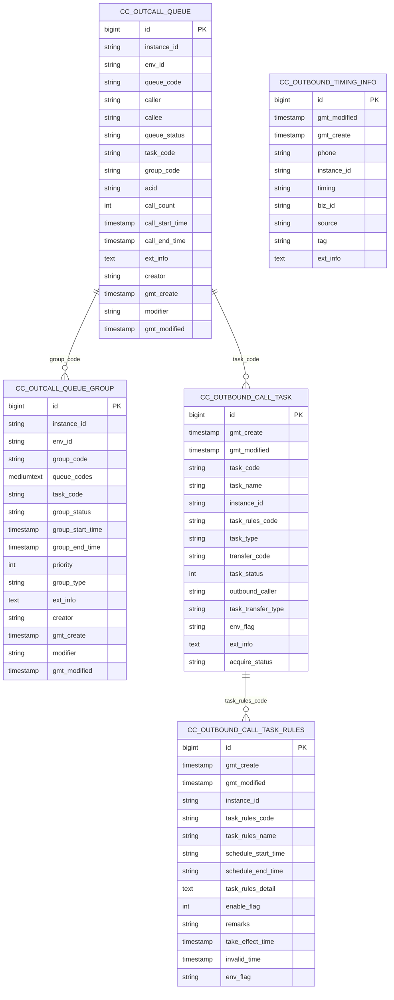
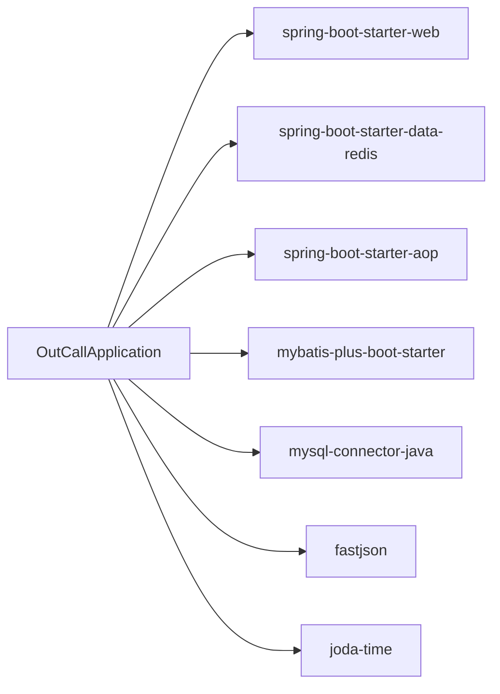

# 项目概述

<cite>
**本文引用的文件**
- [OutCallApplication.java](file://src/main/java/org/qianye/OutCallApplication.java)
- [pom.xml](file://pom.xml)
- [application.properties](file://src/main/resources/application.properties)
- [OutcallQueueDO.java](file://src/main/java/org/qianye/entity/OutcallQueueDO.java)
- [OutcallQueueGroupService.java](file://src/main/java/org/qianye/service/OutcallQueueGroupService.java)
- [OutboundCallTaskService.java](file://src/main/java/org/qianye/service/OutboundCallTaskService.java)
- [OutcallQueueController.java](file://src/main/java/org/qianye/controller/OutcallQueueController.java)
- [OutCallService.java](file://src/main/java/org/qianye/OutCallService.java)
- [OutCallServiceImpl.java](file://src/main/java/org/qianye/OutCallServiceImpl.java)
- [OutCallExecutorService.java](file://src/main/java/org/qianye/OutCallExecutorService.java)
- [OutCallRateLimitService.java](file://src/main/java/org/qianye/OutCallRateLimitService.java)
- [TaskPlanService.java](file://src/main/java/org/qianye/TaskPlanService.java)
- [QueueGroupRuntimeProvider.java](file://src/main/java/org/qianye/QueueGroupRuntimeProvider.java)
- [outcall.sql](file://src/main/resources/outcall.sql)
</cite>

## 目录
1. [简介](#简介)
2. [项目结构](#项目结构)
3. [核心组件](#核心组件)
4. [架构总览](#架构总览)
5. [详细组件分析](#详细组件分析)
6. [依赖关系分析](#依赖关系分析)
7. [性能考量](#性能考量)
8. [故障排查指南](#故障排查指南)
9. [结论](#结论)
10. [附录](#附录)

## 简介
Outcall 智能外呼调度系统是一个面向企业通信自动化的后端服务，围绕“预测式外呼”与“择时外呼”的调度策略，通过任务-分组-队列三层模型，实现高并发、可伸缩、可观测的外呼调度与执行。系统采用 Spring Boot 2.7.18 作为应用框架，MyBatis-Plus 进行数据库访问，Redis 提供缓存与分布式锁，MySQL 存储任务、队列与规则数据。系统通过多线程池与限流机制保障吞吐与稳定性，并通过事件发布实现任务生命周期的可观测性。

本项目的业务目标包括：
- 将大量待外呼号码按规则分组并有序调度，提升外呼成功率与效率
- 支持“择时外呼”，依据用户设定的时间段与规则动态调整外呼节奏
- 提供高可用、可扩展的调度能力，满足大规模并发场景
- 通过统一的 API 与数据模型，支撑上层业务系统集成

## 项目结构
项目采用标准的 Spring Boot 工程目录结构，主要模块划分如下：
- 入口类：应用启动入口
- 配置：数据库连接与 MyBatis-Plus 配置
- 实体与映射：数据库实体与 Mapper 接口
- 服务层：任务、队列、规则、计划等业务服务接口与实现
- 控制器：对外提供 REST API
- 工具与常量：通用工具、常量、线程池、限流、缓存等基础设施

图表来源
- [OutCallApplication.java](file://src/main/java/org/qianye/OutCallApplication.java#L1-L13)
- [OutcallQueueController.java](file://src/main/java/org/qianye/controller/OutcallQueueController.java#L1-L71)
- [OutCallServiceImpl.java](file://src/main/java/org/qianye/OutCallServiceImpl.java#L1-L120)
- [OutCallExecutorService.java](file://src/main/java/org/qianye/OutCallExecutorService.java#L1-L60)
- [application.properties](file://src/main/resources/application.properties#L1-L17)
- [outcall.sql](file://src/main/resources/outcall.sql#L1-L120)

章节来源
- [OutCallApplication.java](file://src/main/java/org/qianye/OutCallApplication.java#L1-L13)
- [pom.xml](file://pom.xml#L1-L91)
- [application.properties](file://src/main/resources/application.properties#L1-L17)

## 核心组件
- 应用入口与配置
  - 应用入口负责启动 Spring Boot 应用
  - 配置文件定义了数据源、MyBatis-Plus 映射路径、驼峰映射与日志输出等
- 实体与数据模型
  - 队列表、队列组表、任务表、任务规则表、择时信息表等，支撑外呼调度全链路
- 服务层
  - 任务服务：任务查询、分页、状态变更
  - 队列组服务：队列组查询、分页、状态更新、定时检查、插入与容量控制
  - 外呼服务：外呼调度主流程、组级处理、异步队列处理、限流与重试
  - 计划服务：任务计划生成、分组构建、择时填充、重试组生成
  - 运行时提供者：队列组运行时批取（占位实现）
- 控制器层
  - 对外提供队列的增删改查、分页查询与状态更新等 API

章节来源
- [OutcallQueueDO.java](file://src/main/java/org/qianye/entity/OutcallQueueDO.java#L1-L105)
- [OutcallQueueGroupService.java](file://src/main/java/org/qianye/service/OutcallQueueGroupService.java#L1-L78)
- [OutboundCallTaskService.java](file://src/main/java/org/qianye/service/OutboundCallTaskService.java#L1-L40)
- [OutcallQueueController.java](file://src/main/java/org/qianye/controller/OutcallQueueController.java#L1-L71)
- [OutCallService.java](file://src/main/java/org/qianye/OutCallService.java#L1-L10)
- [TaskPlanService.java](file://src/main/java/org/qianye/TaskPlanService.java#L1-L120)
- [QueueGroupRuntimeProvider.java](file://src/main/java/org/qianye/QueueGroupRuntimeProvider.java#L1-L19)

## 架构总览
系统采用“控制器-服务-数据访问-存储/缓存”的分层架构，结合多线程池与限流策略，形成高吞吐、低延迟的外呼调度流水线。

图表来源
- [OutcallQueueController.java](file://src/main/java/org/qianye/controller/OutcallQueueController.java#L1-L71)
- [OutCallServiceImpl.java](file://src/main/java/org/qianye/OutCallServiceImpl.java#L1-L120)
- [TaskPlanService.java](file://src/main/java/org/qianye/TaskPlanService.java#L1-L120)
- [OutCallRateLimitService.java](file://src/main/java/org/qianye/OutCallRateLimitService.java#L1-L17)
- [QueueGroupRuntimeProvider.java](file://src/main/java/org/qianye/QueueGroupRuntimeProvider.java#L1-L19)
- [OutCallExecutorService.java](file://src/main/java/org/qianye/OutCallExecutorService.java#L1-L60)
- [application.properties](file://src/main/resources/application.properties#L1-L17)
- [outcall.sql](file://src/main/resources/outcall.sql#L1-L120)

## 详细组件分析

### 外呼调度主流程（OutCallServiceImpl）
- 分页扫描“进行中”的任务，异步提交至调度线程池
- 对每个任务维护运行标志，避免重复执行
- 限流与速率控制：基于限流服务与线程池队列长度进行保护
- 队列组批取：从运行时提供者获取待处理组，校验状态后进入组级处理
- 组内异步处理：为每个队列明细分配线程池执行外呼，实时更新状态
- 结束事件：当无更多组或队列时，发布结束事件

图表来源
- [OutCallServiceImpl.java](file://src/main/java/org/qianye/OutCallServiceImpl.java#L78-L255)
- [TaskPlanService.java](file://src/main/java/org/qianye/TaskPlanService.java#L382-L388)
- [QueueGroupRuntimeProvider.java](file://src/main/java/org/qianye/QueueGroupRuntimeProvider.java#L14-L17)
- [OutCallExecutorService.java](file://src/main/java/org/qianye/OutCallExecutorService.java#L1-L60)
- [application.properties](file://src/main/resources/application.properties#L1-L17)

章节来源
- [OutCallServiceImpl.java](file://src/main/java/org/qianye/OutCallServiceImpl.java#L78-L255)

### 任务计划与分组（TaskPlanService）
- 任务计划生成：在任务时间范围内，分批查询“待处理”队列明细，按规则分组并写入队列组
- 择时填充：根据手机号与择时信息，为队列明细设置择时时间
- 重试组生成：异常或失败队列明细重新规划为重试组，支持最大重试次数控制
- 并发与事务：使用并行子批次与事务模板，平衡吞吐与一致性

图表来源
- [TaskPlanService.java](file://src/main/java/org/qianye/TaskPlanService.java#L411-L691)
- [outcall.sql](file://src/main/resources/outcall.sql#L53-L93)

章节来源
- [TaskPlanService.java](file://src/main/java/org/qianye/TaskPlanService.java#L411-L691)

### 线程池与并发控制（OutCallExecutorService）
- 多类线程池：队列组处理、重试、外呼、华北专属、计划任务、通用外呼
- 监控与日志：定时输出各线程池状态，便于运维观测
- 平滑关闭：优雅关闭各线程池，避免任务丢失

图表来源
- [OutCallExecutorService.java](file://src/main/java/org/qianye/OutCallExecutorService.java#L1-L211)

章节来源
- [OutCallExecutorService.java](file://src/main/java/org/qianye/OutCallExecutorService.java#L1-L211)

### 数据模型与索引设计
- 队列表：存储待外呼号码、状态、任务/分组关联、扩展信息与时间字段
- 队列组表：存储分组编码、队列集合、状态、优先级、类型与扩展信息
- 任务表与规则表：任务编码、规则编码、状态、环境标识与扩展信息
- 择时信息表：手机号、时间段、来源与标签等

图表来源
- [outcall.sql](file://src/main/resources/outcall.sql#L1-L218)

章节来源
- [outcall.sql](file://src/main/resources/outcall.sql#L1-L218)

### API 与控制器（OutcallQueueController）
- 提供队列的创建、删除、更新、分页查询与状态更新等接口
- 通过服务层封装具体业务逻辑，保证接口简洁稳定

章节来源
- [OutcallQueueController.java](file://src/main/java/org/qianye/controller/OutcallQueueController.java#L1-L71)

## 依赖关系分析
- 技术栈
  - Spring Boot 2.7.18：应用框架与自动装配
  - MyBatis-Plus：ORM 与 SQL 构造
  - Redis：缓存与分布式锁
  - MySQL：持久化存储
  - Lombok：简化实体类
  - AOP：横切能力
- 依赖关系图

图表来源
- [pom.xml](file://pom.xml#L24-L81)

章节来源
- [pom.xml](file://pom.xml#L1-L91)

## 性能考量
- 线程池隔离：不同职责的线程池隔离，避免相互影响
- 限流与背压：基于限流服务与线程池队列长度进行保护，防止过载
- 分批与并行：任务计划阶段采用分批与并行子批次，降低单次事务压力
- 缓存与锁：Redis 缓存与分布式锁用于运行时批取与组级互斥
- 监控与日志：定时输出线程池状态，便于及时发现瓶颈

## 故障排查指南
- 外呼未触发
  - 检查任务状态与当前时间是否处于外呼时段
  - 查看任务计划是否正确生成队列组
- 队列长时间处于“等待”
  - 检查限流服务是否达到阈值
  - 核对线程池队列长度与活动线程数
- 组级处理异常
  - 查看异常重试组生成逻辑与最大重试次数
  - 检查队列明细状态是否符合预期
- Redis 相关问题
  - 检查分布式锁是否正确释放
  - 核对缓存键空间与过期策略

章节来源
- [OutCallServiceImpl.java](file://src/main/java/org/qianye/OutCallServiceImpl.java#L474-L490)
- [TaskPlanService.java](file://src/main/java/org/qianye/TaskPlanService.java#L142-L190)
- [OutCallExecutorService.java](file://src/main/java/org/qianye/OutCallExecutorService.java#L66-L137)

## 结论
Outcall 智能外呼调度系统通过清晰的分层架构、完善的并发控制与可观测性设计，在企业通信自动化领域提供了高可靠、高扩展的外呼调度能力。系统以任务-分组-队列为核心模型，结合择时与预测式调度策略，能够有效提升外呼效率与成功率。建议在生产环境中配合完善的监控与告警体系，持续优化线程池与限流参数，以应对更大规模的并发场景。

## 附录
- 快速启动
  - 配置数据库与 Redis 连接
  - 导入初始化 SQL
  - 启动应用入口类
- 常用接口
  - 队列管理：创建、删除、更新、分页查询、状态更新
- 最佳实践
  - 合理设置线程池大小与队列长度
  - 使用 Redis 缓存热点数据，减少数据库压力
  - 通过事件与日志建立完整的可观测性体系